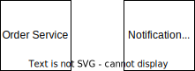

# Java template for Spring Boot 2.7.x and 3.1.x

This tutorial explains how to use the generator in an api first approach using the async api specification. Before we start coding lets understand the concept of message owner and message client. Understanding that allows us to decide which project the AsyncAPI specification should be applied to.

## Understanding basic concept of "message owner" and "message client"

Before we start designing the async api we have to define the owner and client of our
message. First explain what I mean with a message owner and client. To 
better understand the concept, let's take a look at the following example:

Let's consider we are building a component responsible for processing orders in 
an online shop. Every time a new order is created in the shop an email have to be sent
to the customer. For sending emails we have another component called notification service.



Now is the question of how the components communicate with each other. To answer the question we have to better understand how will we develop both components.

### Option 1

In the first option the Notification Service was build for a marketing team which wants to send emails to customers when a new order is created. The team which owns  the notification service
is responsible for the email content. The Notification Team knows that when a new order is created then
an email have to be sent to a customers. From the previous sentence we know exactly which service should know about the other service. So the Notification Service knows the concept of an Order. Then the visibility graph looks as follows:


The Notification Service knows the Order Service but Order Service does not know the Notification Service.
To achieve such visibility the Order Service has to publish a message that a new order is created. The Notification Service has to subscribe to the message and sent an email to the customer.

To achieve that we use some message bus like kafka. The full picture would look like this:


Having that picture the owner of our message is Order Service and the client is Notification
Service. In that case the owner is the message "producer" and the client is the "consumer".

### Option 2

Let's consider the case where the Team for the Notification Service is only responsible for sending emails. The Notification Team does not care about the content of the email and 
does not know when the email have to be sent. The Notification Service can only send emails.
In that scenario the Team responsible for the Order Service decides about the content of the
email. In that case the Order Service knows Notification Service but the Notification Service does not know the Order Service.

So the visibility diagram would look like this:


In that case the Order Service send an event to the Notification Service which then emailed the customer. 
Even the producer of the message is still Order Service and the consumer is
Notification Service, the owner of the message is now Notification Service.


### In which component should we put the async api specification?

The async api specification should be put always in the message owner component. In option 1 the async api should be implemented in the Order Service. In option 2 the async api should be implemented in the Notification Service.

Of course in option 1 we could write in the Notification Service an api specification were
we consume the message from the Order Service. But it would mena we have to duplicate the
structure of the order message. In addition, a developer who reads the  Notification
Service could think he can send an event OrderCreated event he is not the owner of that message which lead to broken functionality.

## Start coding with the async api specification

In the following example we will implement the scenario from Option 1.


First start with the Order Service. As the Order Service is the owner of the message we 
implement the async api specification in the Order Service. As an event bus kafka will be used. As package manager we will use gradle and use Spring boot 3.2.x. With newer spring version it also should work. 

# Step 1: Create the async api specification

The full project will be located in the directory `online-shop-example-1`. First create the Order module where our asyncapi will be placed.

In the `online-shop-example-1` create a directory `/order/src/main/resources` and creat the file `asyncapi.yml` with the following content:

```yaml
asyncapi: 3.0.0
info:
  title: Order Service
  version: 1.0.0
  description: "Service responsible for processing orders"
servers:
  local:
    host: localhost:8080
    protocol: kafka
    description: Local server
channels:
  # define the channel which is translated to a kafka topic
  orderCreated:
    address: "OrderCreated"
    messages:
      orderCreatedMessage:
        $ref: "#/components/messages/OrderCreated"
operations:
  processOrderCreation:
    # define the operation if we produce message or consume message. 
    # action = 'send' mean we will produce a message 
    # action = 'receive' mean we will consume a message  
    action: "send"
    channel:
      $ref: "#/channels/orderCreated"
components:
  messages:
    OrderCreated:
      payload:
        type: object
        properties:
          customerEmail:
            type: string
            format: email
            description: the email of the customer
          orderId:
            type: string
            description: The order id
```
Now with the api spec we see that our service will send/produce messages when a new
order is created. The message will contain the email of the customer and the order id. With this api spec we say that the owner of the message `OrderCreated` is the Order Service.

# Step 2: Generate the owner code

The `java-template` can generate the message owner code and the client code. Because we are implementing the owner code we will generate code to produce the message. The generated code should not be in the main source code that's why we will generate the code in the `build` directory. 

To generate the code I will use docker image to generate the code. That allows us to not worry about installing the right node version.

The following gradle task was build to generate the code:

```groovy
tasks.register("generateCode", Exec) {
    it.commandLine "docker", "run",
            "--rm", "--user=root",
            "-v", "${project.projectDir}/src/main/resources/asyncapi.yaml:/app/asyncapi.yaml",
            "-v", "${project.projectDir}/build/generated-sources/asyncapi:/app/out",
            "asyncapi/cli:2.11.0", "generate",
            "fromTemplate", "-o", "/app/out",
            "/app/asyncapi.yaml", "https://github.com/krystiansola/java-template",
            "--force-write", "-p",
            "server=local", "-p", "library=spring",
            "-p", "package=example.producer.app"
}
```

After Executing the gradle task:
```commandline
./gradlew order:generateCode
```
in the directory `order/build/generated-sources/asyncapi` the generated code will be placed.

To use the generated code in your java project we have to define the right source set: 

```groovy
sourceSets {
    main {
        java {
            srcDir 'build/generated-sources/asyncapi'
        }
    }
}
```

Now rebuild you project and you can use the generated code. Although we need some additional dependencies to make it work.

Because we are using spring boot we have to add the following plugins to our `build.gradle` file: 

```groovy
plugins {
    id 'org.springframework.boot' version '3.2.0'
    id 'io.spring.dependency-management' version '1.1.6'
}
```

And the following dependencies:

```groovy
dependencies {
    // lombok is required for the generated code
    compileOnly 'org.projectlombok:lombok:1.18.36'
    annotationProcessor 'org.projectlombok:lombok:1.18.36'

    implementation 'org.springframework.boot:spring-boot-starter'
    implementation 'org.springframework.boot:spring-boot-starter-web'
    implementation 'org.springframework.kafka:spring-kafka'
}
```

The generated code is using lombok annotation thats why we have to add the lombok dependency. The `spring-kafka` dependency is required to send messages to kafka.

The `spring-boot-starter-web` dependency is required to start a simple web application. Our App will be a web application which send events.

In the package `exaple.shop.app` create the following class:

```java
package exaple.shop.app;

import org.springframework.boot.SpringApplication;
import org.springframework.boot.autoconfigure.SpringBootApplication;

@SpringBootApplication
public class OrderApp
{
    public static void main(String[] args) {
        SpringApplication.run(OrderApp.class, args);
    }
}
```

And an order controller class:

```java
package exaple.shop.app;

import org.springframework.web.bind.annotation.PostMapping;
import org.springframework.web.bind.annotation.RequestBody;
import org.springframework.web.bind.annotation.RestController;

@RestController
public class OrderController
{
    @PostMapping("/order")
    public Order createOrder(@RequestBody Order order)
    {
        return order;
    }
}

```

Now when you start the app then the webservice return what was sent to it.

Now when a new order is created we will send a kafka message to notify about a 
new order. 

Here we can use our generator code. Autowire the `OrderCreatedProducer` into the `OrderController` class:

```java
@RestController
public class OrderController
{
    @Autowired
    private OrderCreatedProducer orderCreatedProducer;
    ...
```

What is still missing is the bean creation of the `OrderCreatedProducer`.

So create a configuration class:

```java
package exaple.shop.app;

import org.springframework.context.annotation.Bean;
import org.springframework.context.annotation.Configuration;
import org.springframework.kafka.core.KafkaTemplate;

import example.producer.app.OrderCreatedProducer;

@Configuration
public class OrderConfiguration
{
    @Bean
    OrderCreatedProducer orderCreatedProducer(KafkaTemplate<Integer, Object> kafkaTemplate)
    {
        return new OrderCreatedProducer(kafkaTemplate);
    }
}
```

And now adjust the controller in that way that for every REST request a new kafka message is sent:

```java
    public Order createOrder(@RequestBody Order order)
    {
        // Create the message
        OrderCreatedMessage message = OrderCreatedMessage.builder()
                .orderId(order.getOrderId())
                .customerEmail(order.getCustomerEmail())
                .build(); 
        // send the message
        orderCreatedProducer.send(message);
        return order;
    }
```

Now run some kafka cluster and start the application. When executing the following curl:
```commandline
curl --request POST \
--url http://localhost:8080/order \
--header 'Content-Type: application/json' \
--data '{
"orderId": "some-order-id",
"customerEmail":  "krystian.sola@gmail.com"
}'
```

A kafka event will be sent but now no consumer is listening to the event. In the next step we will implement the consumer.

# Step 3: Implement the consumer


